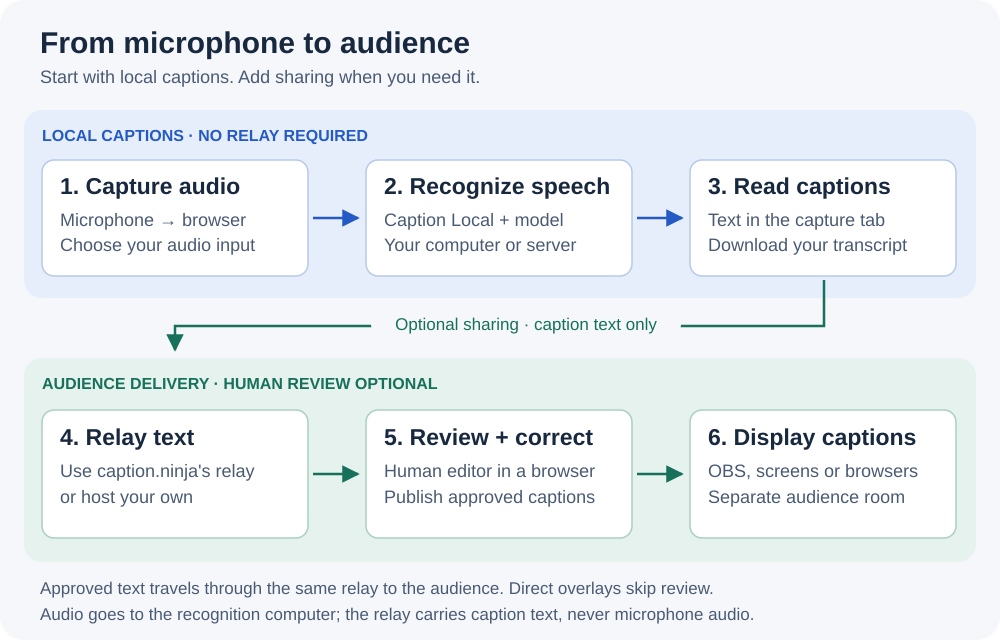
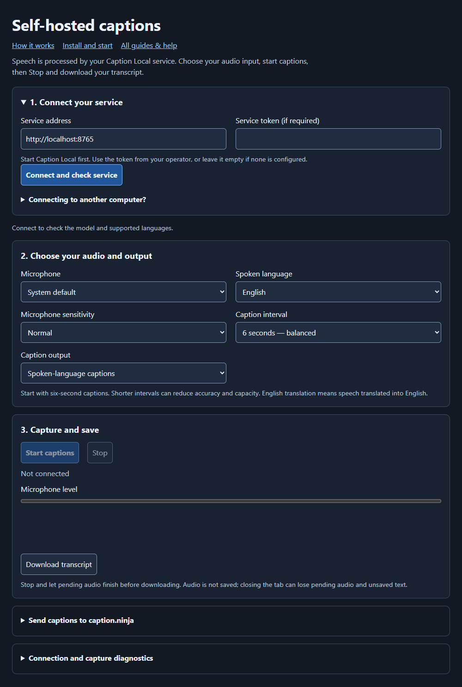
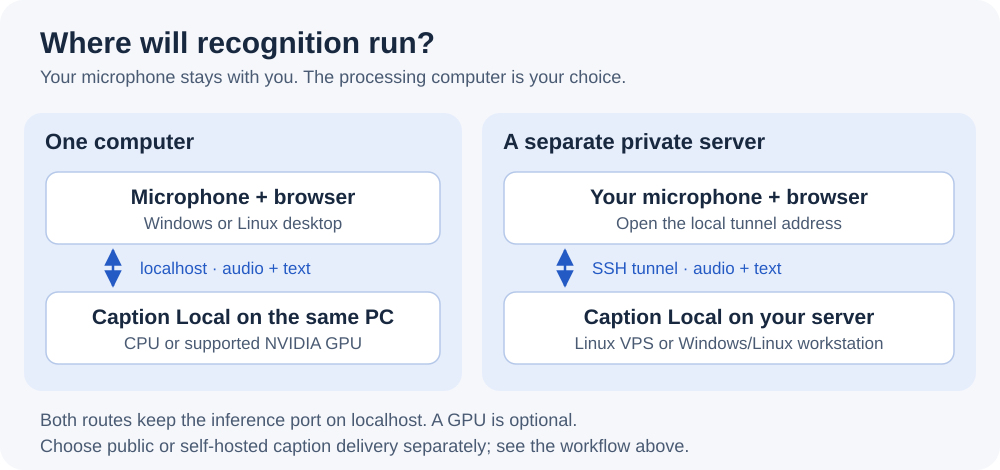

# Self-hosted captions: a visual introduction

[All guides](README.md) · [Install](GETTING-STARTED.md) · [Troubleshooting](TROUBLESHOOTING.md)

**Turn speech into captions on hardware you control.** Caption Local runs the
speech model; a browser captures your microphone and shows the text. Start with
one computer and one microphone. Caption.ninja's editor and audience overlays are
optional additions, and you can host their caption relay too.

No paid transcription account or cloud AI key is needed. You do need to install
software, download a model and keep the service running while you use it.

[Choose a setup](#choose-your-setup) · [See the screen](#what-you-will-use) ·
[Understand the hardware](#choose-hardware-and-quality) · [Get started](#your-first-session)

## Follow the captions

[Open the workflow diagram at full size](assets/caption-workflow.svg), or follow
the same steps in text:

1. **Capture:** choose a microphone or an audio input in the browser.
2. **Recognize:** Caption Local processes that audio on your computer or private
   server. Choose transcription in the spoken language, translation into English,
   or both.
3. **Use the text:** read captions in the capture tab and download a transcript.
4. **Share, optionally:** send text through a relay to the human editor, then to
   an audience overlay. Approved text returns through that relay in a separate
   output room. A direct overlay can skip human review.

The **relay** is a small service that forwards caption text. It does not recognize
speech and does not need a GPU. Running recognition yourself and running the relay
yourself are two independent choices.

## Choose your setup

### Captions just for you — start here

Run Caption Local and one browser tab. Install Python or use existing Docker,
download a model, and select your microphone. No relay or caption.ninja account
is needed. [Get your first local captions](GETTING-STARTED.md).

### Your own recognition, with an editor or OBS

Run Caption Local and open caption.ninja's editor/overlay pages. Set separate
source and audience rooms, then enable sharing. Text travels through the public
relay unless you choose a private one. [Set up capture, editing and sharing](CAPTION-NINJA-LOCAL.md).

### Your own recognition and caption delivery

Also run the Node relay and your editor/overlay pages. Add Node.js 22+, generate
room credentials, and connect the pages. A local setup can serve everything on
localhost; internet-facing relay hosting needs HTTPS/WSS.
[Follow the private relay setup](https://github.com/steveseguin/captionninja/blob/master/relay/README.md).

For the fully self-hosted route, each relay room has separate publishing and
viewing tokens. The editor needs permission to read the source room and publish
to the audience room; viewers need only the audience room's viewing token. The
inference service's optional access token is separate. The setup panels label
these fields, and the editor can generate a view-only OBS link.

For a first try, use the bundled `http://localhost:8765/capture-local.html` page.
The separate hosted page is another option; its service token, exact allowed
origin and browser local-network permission require extra setup. Follow the
[tested hosted-page instructions](CAPTION-NINJA-LOCAL.md#optional-use-the-separate-captionninja-page)
for the working URL. The main caption.ninja page keeps its existing workflow.

## What you will use

The capture page has a service connection, microphone and language selectors,
output choices, and Start/Stop controls. Captions appear below them. Expand the
sharing options when you need an editor or overlay. Diagnostics show buffered
audio, response times and errors; model and worker settings stay on the server.
After connection, the service panel collapses and focus moves to Microphone.
Reopen it to edit the connection. Optional sharing and diagnostics follow the
capture/save controls, and **All guides & help** stays at the top.

See the actual capture page before connecting

This is the real page in Edge, before connecting to inference. Available languages
and controls update after connection. It is a documentation screenshot, not a
performance test or a recording of someone's microphone.

For an event, a typical arrangement is one capture tab per independent audio
input, an editor tab for review, and an overlay URL added as an OBS Browser Source
or opened on an audience display. Keep source rooms separate between producers.
More viewers mainly add relay traffic; more microphones add speech-processing work.

## Choose hardware and quality

[Open the hosting diagram at full size](assets/hosting-options.svg).

- **Desktop CPU:** start with multilingual `small` and one stream. No GPU setup
  is required; larger models and more streams need more CPU time and memory.
- **Supported NVIDIA GPU:** follow the CUDA guide, then compare multilingual
  models. Allow for VRAM and setup requirements; benchmark accuracy and throughput.
- **Private Linux VPS or another workstation:** run recognition there and connect
  through SSH. Audio travels through the tunnel; the microphone stays with you.
- **Existing Docker installation:** use the supplied Compose route to keep runtime
  dependencies in a container. Models still need storage, and NVIDIA containers
  have additional prerequisites.

For native installation, **Python 3.12 on Intel/AMD 64-bit Windows or Linux** is
the tested starting point. Allow at least **4 GiB RAM and several GB of disk** for
a first small-model trial; these are planning allowances, not proven minimums.
Use desktop Chrome or Edge and an audio input it can select. A self-hosted relay
adds Node.js 22+; it does not need a Python environment or a speech model.

Keep inference bound to localhost; use an SSH tunnel for another computer. You do
not need a domain, public port or TLS certificate for the first local trial.
Software/model downloads need internet access initially. Local captions can work
offline once setup is complete and the model is cached; remote sharing still
needs a working network, and cloud translation/TTS options need their providers.

[Hardware and quality profiles](DEPLOYMENT-PROFILES.md) ·
[Windows/NVIDIA setup](WINDOWS-GPU.md) · [Native and Docker deployment](../DEPLOYMENT.md)

## Your first session

1. **Install and start one local stream.** Follow [Getting started](GETTING-STARTED.md)
   for the exact commands. First launch installs dependencies and downloads the
   model; it can take considerably longer than later starts.
2. **Connect and check the service.** Confirm the model and actual CPU/CUDA device.
   Start with the default multilingual model and six-second caption interval.
3. **Rehearse with your input.** Choose the microphone and spoken language. Speak
   a short passage, pause, and check the text. Other applications' audio needs a
   separately configured input; it is not captured automatically.
4. **Stop, drain and save.** Wait for captured audio to finish processing, then
   download the transcript. Closing the tab can lose pending audio and unsaved text.
5. **Add sharing and more streams only after that works.** Follow the setup you
   chose above. Rehearse the actual languages, background noise and output mix.

Use the documentation shipped with your download. The separate capture page and
private relay integration are in the current source; published v1.1.0 predates
them. The installation guide explains which source archive to use.

## Set expectations before an event

- **Several seconds of delay:** speech normally collects in roughly six-second
  windows before processing; queueing and human review add time. A few milliseconds
  of relay delivery does not mean instant speech captions.
- **Accuracy varies:** names, accents, noise and overlapping speakers can produce
  wrong or repeated text. Larger models are not uniformly better. Translation
  here means into English; optional downstream TTS is a separate feature.
- **Capacity depends on the workload:** eight CPU streams and twelve TITAN RTX
  streams passed specific hour tests on the measured machines. These are not
  default settings or promises for another host or twelve simultaneous translations.
- **Overload is visible:** growing audio buffers mean the service is falling
  behind. Reduce the workload; increasing buffers does not make recognition faster.
- **Recovery is bounded:** the private relay retains a short history in RAM and
  reports gaps. Server restarts and page reloads can lose state; save your work.
- **Hosting brings responsibility:** keep software running, manage credentials,
  monitor errors, and rehearse recovery. A public relay needs a secured deployment;
  the inference service is intended for trusted producers, not public user accounts.

[Measured speech results](DEPLOYMENT-PROFILES.md) ·
[Measured relay results and limits](../evidence/relay-recovery/report.md) ·
[First-event checklist](FIRST-EVENT.md) · [Troubleshooting](TROUBLESHOOTING.md)

The diagrams are editable SVGs with text alternatives above. The screenshot can
be refreshed with `python scripts/capture_onboarding.py` after installing the
development dependencies and a supported browser.
